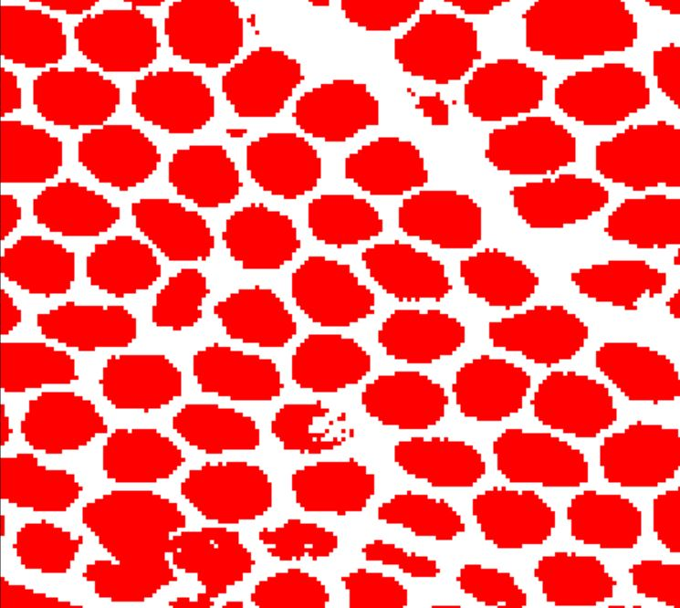
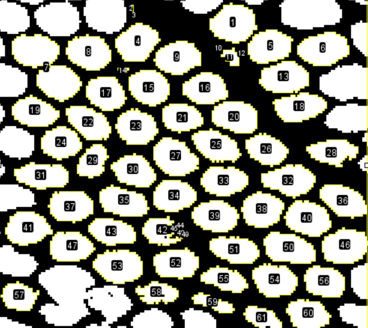

```{r setup, include=FALSE}
knitr::opts_chunk$set(echo = TRUE)
```

# Introduction

Libraries

```{r message=FALSE, warning=FALSE}

library(ggplot2) 
library(wesanderson) 
library(gridExtra)
library(rptR)
library(cowplot)
library(pavo)
library(tidyverse) 
library(dplyr) 
library(kableExtra) 
library(graphics)
library(matrixStats)

```

Data Sets

```{r message=FALSE, warning=FALSE}

Reflect<-read.csv("../Data/1_HemisphericalReflectance.csv") %>% 
  as.rspec(.) %>% 
  procspec(.,fixneg = "zero")


Trans<-read.csv("../Data/2_Transmittance.csv") %>% 
  filter (wl <= 1700 & wl >= 400) %>% 
  as.rspec(.) %>% 
  procspec(.,fixneg = "zero")


RefVis<-read.csv("../Data/3_ReflectanceVisModels.csv") %>% 
  as.rspec(.) %>% 
  procspec(.,fixneg = "zero") %>% 
  aggspec(., by=4) %>% 
  filter(wl <=700 & wl>=300) 

Transmicro <- read.csv("../Data/4_TransmittanceMicroScale.csv")

Cylinders <- read.csv("../Data/4_XylonichusCylinderDiameters.csv")

Centroids <- read.csv("../Data/5_XylonichusCentroidDistance.csv")

QuasiOrder <-  read.csv("../Data/6_PrumModelResults.csv")

Ordered <-  read.csv("../Data/7_PhotonicCrystalModelResults.csv")

```

# Macro Scale

Comparison between the optical properties at a macro scale for the three beetles

```{r}

P_Prsi<-ggplot() +

  geom_ribbon(data=Trans,
              mapping = aes(x=wl,y=100-prsi3d,
                            ymin=100,ymax=100-prsi3d), 
              fill="#b7b7b7", colour="black", alpha=0.5)+ # Transmittance
  
  geom_ribbon(data=Trans,
              mapping = aes(x=wl,y=100-prsi3d,
                            ymin=Reflect$prsi3,ymax=100-prsi3d), 
              colour="black", fill="#2b8fff", alpha=0.5)+ # Absorbance
  
  geom_area(data=Reflect, aes(x=wl, y=prsi3),
            fill="#f8f813", colour="black", alpha=0.5) + # Reflectance
  
  scale_x_continuous(limits=c(400, 1700),
                     expand = c(0, 0))+
  scale_y_continuous(limits=c(0, 100), breaks = c(50,100), 
                     expand = c(0, 0),
                     sec.axis = sec_axis(~100-.,breaks = c(100,50))) +
  theme_classic()+
  theme(axis.title.x = element_blank(),
        axis.text.x = element_text(color="white"))+
  theme(axis.text.y = element_text(size =18)) +
  ylab( " " )+
  theme(plot.margin = unit(c(0.6,0.4,0.1,0.4), "cm"))+
  geom_vline(xintercept = 700, linetype="dotted", 
                color = "black", size=1)


P_Xyln<-ggplot() +

    geom_ribbon(data=Trans,
              mapping = aes(x=wl,y=100-xyln3d,
                            ymin=100,ymax=100-xyln3d), 
              fill="#b7b7b7", colour="black", alpha=0.5)+ # Transmittance
  
    geom_ribbon(data=Trans,
              mapping = aes(x=wl,y=100-xyln3d,
                            ymin=Reflect$xyln3,ymax=100-xyln3d), 
              colour="black", fill="#2b8fff", alpha=0.5)+ # Absorbance
  
  geom_area(data=Reflect, aes(x=wl, y=xyln3),
            fill="#f8f813", colour="black", alpha=0.5) + # Reflectance
  
  scale_x_continuous(limits=c(400, 1700),
                     expand = c(0, 0))+
  scale_y_continuous(limits=c(0, 100), breaks = c(50,100), 
                     expand = c(0, 0),
                     sec.axis = sec_axis(~100-.,breaks = c(100,50))) +
  theme_classic()+
  theme(axis.title.x = element_blank(),
        axis.text.x = element_text(color="white"))+
  theme(axis.text.y = element_text(size =18)) +
  ylab( " " )+
  theme(plot.margin = unit(c(0.15,0.4,0.15,0.4), "cm"))+
  geom_vline(xintercept = 700, linetype="dotted", 
                color = "black", size=1)


P_Ocul<-ggplot() +

  geom_ribbon(data=Trans,
              mapping = aes(x=wl,y=100-oliv2d,
                            ymin=100,ymax=100-oliv2d), 
              fill="#b7b7b7", colour="black", alpha=0.5)+ # Transmittance
  
  geom_ribbon(data=Trans,
              mapping = aes(x=wl,y=100-oliv2d,
                            ymin=Reflect$oliv2,ymax=100-oliv2d), 
              colour="black", fill="#2b8fff", alpha=0.5)+ # Absorbance
  
  geom_area(data=Reflect, aes(x=wl, y=oliv2),
            fill="#f8f813", colour="black", alpha=0.5) + # Reflectance
  
  scale_x_continuous(limits=c(400, 1700),
                     expand = c(0, 0))+
  scale_y_continuous(limits=c(0, 100), breaks = c(50,100), 
                     expand = c(0, 0),
                     sec.axis = sec_axis(~100-.,breaks = c(100,50))) +
  theme_classic()+
  theme(axis.title.x = element_blank())+
  theme(axis.text.y = element_text(size =18)) +
  theme(axis.text.x = element_text(size =18)) +
  ylab( " " )+
  theme(plot.margin = unit(c(0.1,0.4,0.3,0.4), "cm"))+
  geom_vline(xintercept = 700, linetype="dotted", 
                color = "black", size=1)


```

```{r out.width = "75%"}

# Align the three plots:
plot_grid(P_Prsi, P_Xyln, P_Ocul, 
          align = "v", nrow=3, ncol=1, rel_widths = c(1, 1))
```

Yellow = Reflectance grey = Transmittance (inverted axis) blue = Absorbance

<br> <br>

# Transmittance Scatterometer

The three beetles have very similar transmittance profile in their cuticle.

```{r}
# Prepare for plot
Transmicro<-
  Transmicro %>% 
  mutate(across(spp, factor, levels=c("A.pras","X.euca","P.ocul")))
```

```{r out.height="60%"}
# plot
ggplot(data=Transmicro, aes(wl,Transm,spp))+
  geom_line()+
  facet_wrap(~spp)+
  theme_bw()+
  theme(
    strip.background = element_blank(),
    strip.text.x = element_blank()
  )

```

<br> <br>

# Models

Photonic crystal

```{r}

OrderModel <- 
  Ordered %>% 
  gather (mod, Reflectance, -wl) %>% 
  mutate (Polarization = substr(mod,1,7),
          Cylinder = substr(mod,8,13)) 

PolarizA <-
  OrderModel %>% 
  filter (Polarization == "Perpen")
  
PolarizB <-
  OrderModel %>% 
  filter (Polarization == "Parall")
  
LINES <- c("ParallP0700nm" = "solid",
           "ParallP0820nm" = "solid", 
           "ParallP1000nm" = "solid",
           "PerpenP0700nm" = "dashed",
           "PerpenP0820nm" = "dashed",
           "PerpenP1000nm" = "dashed")

  
COLORS <- c("ParallP0700nm" = "#c4a922",
            "ParallP0820nm" = "black", 
            "ParallP1000nm" = "grey",
            "PerpenP0700nm" = "#c4a922",
            "PerpenP0820nm" = "black",
            "PerpenP1000nm" = "grey")


M1P <- ggplot(OrderModel, aes(x=wl, y = Reflectance, 
                       linetype = factor(mod), color=mod))+
  geom_line(size=0.8)+
  theme_bw() + 
  scale_linetype_manual(values = LINES) +
  scale_color_manual(values = COLORS )+
  theme(legend.position="none")+
  xlab("Wavelength (nm)") +
  ylab("Reflectance (%)") +
  xlim(400,1700) +
  theme(axis.title.y = element_text(
    margin = margin(t = 0, r = 10, b = 0, l = 0)))


```

Quasi-ordered model

```{r}

PlotM1 <- 
  QuasiOrder %>% 
  mutate(., MeanS1 = rowMeans(select(., starts_with("Xyln1."))),
         ., MeanS2 = rowMeans(select(., starts_with("Xyln2."))),
         ., MeanS3 = rowMeans(select(., starts_with("Xyln3."))),
         ., MeanS4 = rowMeans(select(., starts_with("Xyln4."))),
         ., MeanS5 = rowMeans(select(., starts_with("Xyln5."))),
         ., MeanS6 = rowMeans(select(., starts_with("Xyln6."))),
         ., MeanS7 = rowMeans(select(., starts_with("Xyln7."))),
         ., MeanS8 = rowMeans(select(., starts_with("Xyln8."))),
         ., MeanS9 = rowMeans(select(., starts_with("Xyln9.")))) %>%
  select(wl,contains("Mean")) 

PlotM1Means <- 
  PlotM1 %>% 
  mutate(Xyl.sd = rowSds(as.matrix(PlotM1[,2:10]))) %>% 
  mutate(Xyl.mean = rowMeans2(as.matrix(PlotM1[,2:10]))) %>% 
  select(wl,Xyl.sd,Xyl.mean) 
  

M2P <- ggplot(PlotM1Means, aes(x=wl)) +
  geom_ribbon(aes(y = Xyl.mean*100, 
                  ymin = Xyl.mean*100 - Xyl.sd*100, 
                  ymax = Xyl.mean*100 + Xyl.sd*100, 
                  fill = "#DCDCDC"), alpha = .4) +
    geom_line(aes(x=wl, y=Xyl.mean*100),
            size=1, colour="black")+
  scale_fill_manual(values=c("#DCDCDC"))+
  theme_bw() + 
  ylab("Probablity of Reflectance x 100")+
  xlab("wavelength (nm)")+
  theme(legend.position="none")+
  xlim(400,1700) +
  theme(axis.title.y = element_text(
    margin = margin(t = 0, r = 10, b = 0, l = 0)))
  

```

## Contrast between the two models

```{r warning=FALSE}

plot_grid(M1P, M2P, 
          align = "v", nrow=2, ncol=1, rel_widths = c(1, 1))


```

# Statistical Descriptors

Table with the statistical descriptors of the cylinders in the Xylonichus white underlay structures

Here we refer as "particle" to the clear circle in a matrix in a transversal section: 


```{r echo=FALSE, fig.cap="One rectangle of one TEM section", out.width = '50%', out.height='50%'}
knitr::include_graphics("../Images/TEMexample.JPG")
```

Then, we used the plugin Analyze particles in Image J to obtain  statistical descriptors for the shapes of the transversal sections of the cylinders. 

To do this we convert the image to black and white, then apply a threshold: 

```{r echo=FALSE, fig.cap="Example of a threshold to identify particles", out.width = '50%', out.height='50%'}

```

Then, the plugin assigns a number to each particle, fits an elypse to each particle and outputs the basic stats. 

```{r echo=FALSE, fig.cap="Example of the numbers assigned to each particle in the area (each particle is also refered as the region of interes, ROI)", out.width = '50%', out.height='50%'}

```

Note: Although it is not shown here, the procedure also includes two extra steps to remove particles that are too small and probably just artifacts. 

<br>
<br>

Summary of the results in a table

Coming soon...

```{r eval=FALSE}
summary(Cylinders$MajorAxisnm)
length(Cylinders$MajorAxisnm)
sd(Cylinders$MajorAxisnm)
summary(Cylinders$MinorAxisnm)
length(Cylinders$MinorAxisnm)
sd(Cylinders$MinorAxisnm)


summary(Centroids$Euclideannm)
sd(Centroids$Euclideannm)
length(Centroids$Euclideannm)


```

<br> 
<br>

## Cylinder diameters

```{r}

Cylinders <- 
  Cylinders %>% 
  mutate(MajorAxisnm = MajorAxis * 1000, # from microns to nm
         MinorAxisnm = MinorAxis * 1000) # from microns to nm

# Prepare for the plot
HistAxis<-
  Cylinders %>% 
  select (MajorAxisnm, MinorAxisnm ) %>% 
  gather (Axis, Length) 

# Plot
ggplot(HistAxis, aes(x=Length, fill=Axis, color=Axis))+
  geom_histogram(fill="gray", alpha=0.3, 
                 position="identity", binwidth=25)+
  theme_bw()+
  theme(legend.position="top")+
  ylab("Counts")+
  xlab("Cylinder Diameter (nm)")+ 
  theme(legend.position = c(0.8,0.5))+
  theme(legend.title = element_blank())+
  theme(legend.text = element_text(size=7))+
  scale_color_manual(labels = c("Major axis", "Minor axis"),
                     values=c("#8dbb53", "#b39eff")) +
  theme(legend.key.size = unit(0.4, 'cm'))

```

## Centroid distances

The software provides the centroid distances as the x and y position in the image for each particle, in micrometers. To calculate the centre to centre distance, it is necesary to use the formula for euclidian distances

```{r}

Centroids <- 
  Centroids %>% 
  # Calculate euclidean distance:
  mutate(Euclidean = sqrt(((x1-x)^2)+((y2-y)^2))) %>% 
  # convert from microns to nm
  mutate(Euclideannm = Euclidean * 1000)

# Plot:
ggplot(Centroids, aes(x=Euclideannm))+
  geom_histogram( color="#ffd781" ,fill="#ffd781", alpha=0.3,
                  position="identity",binwidth=50)+
  theme_bw()+
  theme(legend.position="top")+
  ylab("Counts")+
  xlab("Centre - Centre Distance (nm)")+ 
  theme(legend.position = c(0.8,0.5))+
  theme(legend.title = element_blank())+
  theme(legend.text = element_text(size=6))

```

## Circularity

This parameter indicates how circular are the particles. When the circularity is closer to 1, this means that the relationship between area and perimeter is close to 1, so the particle has a regular perimeter

```{r}

# Plot:
ggplot(Cylinders, aes(x=circ.)) +
  geom_histogram( color="#0e0928" ,fill="#93c7ff", alpha=0.5,
                  position="identity")+
  theme_bw()+
  theme(legend.position="top")+
  ylab("Counts")+
  xlab("Circularity (4π*area/perimeter^2)")+ 
  scale_x_continuous(breaks=seq(0,1,0.2))+
  theme(legend.position = c(0.8,0.5))+
  theme(legend.title = element_blank())+
  theme(legend.text = element_text(size=6))

```

## Aspect ratio

Major Axis/minor Axis

If this value is far away from 1, it means that the elipse is flattened. if close to 1, it means that the elypse is close to a circle.

```{r}

# Plot:
ggplot(Cylinders, aes(x=AR)) +
  geom_histogram( color="#0e0928" ,fill="#93c7ff", alpha=0.5,
                  position="identity")+
  theme_bw()+
  theme(legend.position="top")+
  ylab("Counts")+
  xlab("Aspect Ratio (Major Axis/Minor Axis")+ 
  theme(legend.position = c(0.8,0.5))+
  theme(legend.title = element_blank())+
  theme(legend.text = element_text(size=6))

```

## Angle

This parameter indicates varies between 0-180 degrees, and it is the angle between the primary axis and a line parallel to the x-axis of the image.

```{r}

# Plot:
ggplot(Cylinders, aes(x=angle)) +
  geom_histogram( color="#0e0928" ,fill="#93c7ff", alpha=0.5,
                  position="identity")+
  theme_bw()+
  theme(legend.position="top")+
  ylab("Counts")+
  xlab("Angle (elypse axis to the image x axis)")+ 
  scale_x_continuous(breaks=seq(0,180,20))+
  theme(legend.position = c(0.8,0.5))+
  theme(legend.title = element_blank())+
  theme(legend.text = element_text(size=6))

```

## Correlations

We evaluated the correlation between the centre to centre distance and the diameter

First we need to create unique codes for the particles including the TEM number \_ the rectangle number \_ the ROI number.

In this way, we can combine the two data frames, cylinders diameter and centre to centre distance. Thus, for each particle we will obtain its diameter and its centre-to-centre distance to *one* of its adjacent particles.

```{r message=FALSE, warning=FALSE}

Cylinders2 <-
  Cylinders %>% 
  unite("ROICode",c("section","rectangle","ROI")) %>% 
  select(ROICode,MajorAxisnm,MinorAxisnm)

Centroids2 <-
  Centroids %>%
  mutate(label2 = substr(label,16,18)) %>% 
  unite("ROICode",c("label2","ROI"),remove=FALSE) %>% 
  unite("ROICompCode",c("label2","ROIcomp"),remove=FALSE) %>% 
  select(ROICode,ROICompCode,Euclideannm) %>% 
  # order:
  arrange(ROICompCode) %>% 
  #remove particles that do not have diameter info:
  filter(ROICompCode!="1_4_17") 

StructStats <- 
  Cylinders2 %>% 
  # select the ROIs for which we have the centroid distances:
  filter (ROICode  %in% (Centroids2$ROICompCode)) %>% 
  # order:
  arrange(ROICode) %>% 
  # Join data frames: cylinders with Centroids 
  bind_cols(.,Centroids2) %>% 
  select(-ROICode...1) %>% 
  rename(AdjROI = ROICode...4) %>% 
  select(4,1,2,3,5) %>% 
  filter(MajorAxisnm<1400)

head(StructStats)
```

In this data frame, the first column is the label of the particles (i.e. transversal section of a cylinder in the white underlay of X. eucalypti) that we are studying. Second column and third column are the diameter. Since the particles are an elypse, we kept the major and minor axis. Column 4 is the the label of a particle adjacent to the particle in column 1. Column 5 is the centre to centre distance between these two particles.

Now we can test if the diameter of the particle correlates to the centre to centre distance.

```{r}
cor.test(StructStats$MajorAxisnm,StructStats$Euclideannm)

ggplot(StructStats, aes(x = Euclideannm))+
  geom_point(aes(x = Euclideannm,y = MajorAxisnm),
             size=3, alpha=0.5,pch=21,
             col="black",fill="#93c7ff")+
  geom_point(aes(x = Euclideannm,y = MinorAxisnm),
             size=3, alpha=0.5,pch=21,
             col="black",fill="#f8f813")+
  theme_bw()+
  xlab("Centre-centre distance (nm)")+
  ylab("Diameter of particles (nm)")+
  scale_x_continuous(breaks=seq(500,1500,200))+
  scale_y_continuous(breaks=seq(400,1400,200))+
  geom_hline(yintercept=mean(StructStats$MajorAxisnm), 
             linetype="dashed", color = "#0e0928")+
  geom_hline(yintercept=mean(StructStats$MinorAxisnm), 
             linetype="dashed", color = "#abab0d")
  
```

Blue = major axis and yellow = minor axis
